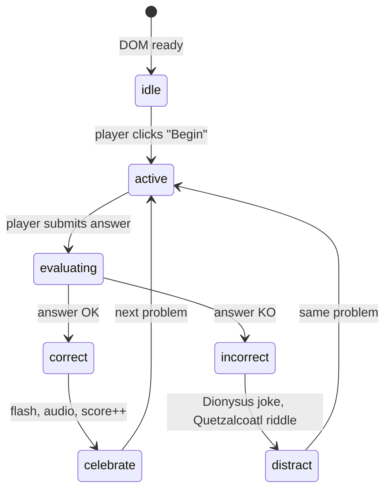

# MathMistress – Game Blueprint

**Theme**: A playful clash of Greek philosophy and myth with a spark of Meso-american mysticism. Socratic reasoning meets Dionysian frenzy while Quetzalcoatl whispers cosmic riddles. The player solves incremental math puzzles while mythic avatars try to derail their focus.

---
## 1. Core Design Goals
1. Zero persistence – no localStorage, cookies, or backend. Every session is fresh.
2. Minimal exposition – Players learn by doing. A solitary "Help" button reveals only the next actionable hint.
3. Distraction-Driven Gameplay – NPCs (Dionysus & Quetzalcoatl) inject timed visual/audio disruptions to shake concentration.
4. Rapid loop – <10 s from page load to first interaction.
5. Accessible – pure HTML5, CSS, vanilla JS. No build step required.

---
## 2. High-Level Architecture
```
MathMistress/
├── index.html          # entry point
├── styles/
│   └── main.css        # layout & animations
├── scripts/
│   ├── core.js         # game loop & state machine
│   ├── mathEngine.js   # generates & validates problems
│   ├── npc.js          # Dionysus & Quetzalcoatl behaviour
│   └── help.js         # progressive-reveal aid system
├── assets/
│   ├── img/            # SVGs & sprites
│   └── audio/          # soft flute, ecstatic drums, etc.
└── tests/
    └── core.test.js    # Jest + jsdom unit tests
```

*No frameworks* – keeps download < 50 kB gzipped, ensures portability to Java or other VMs.

---
## 3. Game Loop (`core.js`)


Key objects:
- `GameState` (enum): `idle | active | evaluating`
- `FocusMeter` (0–100) decrements when NPC distraction fires; reaching 0 triggers soft reset.

Use `requestAnimationFrame` to time UI updates; `setTimeout` for NPC interjections.

---
## 4. Math Engine (`mathEngine.js`)
1. Progressive difficulty: basic arithmetic → fractions → exponents.
2. `generate(level)` returns `{ prompt, answer }`.
3. `validate(input, answer)` strict-equals (no floats where avoidable).

---
## 5. NPC Logic (`npc.js`)
```js
class NPC {
  constructor(name, sprite, phrases, intervalRange) { /* … */ }
  scheduleDistraction() { /* random interval */ }
  trigger() { /* animate + play voice clip */ }
}
export const Dionysus = new NPC('Dionysus', 'dionysus.svg', [
  'Wine break?', 'Dance with satyrs!', 'Logic is overrated!'
], [5000, 12000]);
export const Quetzalcoatl = new NPC('Quetzalcoatl', 'quetzalcoatl.svg', [
  'Feathered wisdom...', 'Cycles of time whisper.', 'Seek the golden ratio.'
], [7000, 15000]);
```

NPCs call `focusMeter.drain(amount)` and briefly jiggle puzzle UI.

---
## 6. Help System (`help.js`)
Progressive revelation array:
```js
const hints = [
  () => highlight("operator"),
  () => fadeIn("Try isolating x"),
  () => showSolutionStep(1),
  // …
];
let ptr = 0;
export function showNextHint() {
  if (ptr < hints.length) hints[ptr++]();
}
```
Button label toggles between "Help" and "Next Hint".

---
## 7. UX & Visuals
* Colors: Antique parchment (#f5eac5) contrasted with twilight purple (#4b2e83).
* Typography: `"Cormorant Garamond", serif` for philosophy quotes, `"Roboto Mono", monospace` for math.
* Small ambient audio loops (volume ≤ 0.2) can be muted.
* Sub-2 s fade-in splash: Plato quote morphs into title *MathMistress*.

---
## 8. Converting Core Logic to Java (Optional)
The self-contained logic in `mathEngine.js` & `npc.js` can be mirrored in pure Java classes:
1. Keep methods stateless (`generate()`, `validate()`).
2. Compile to WASM via TeaVM or transpile with GWT if future Android port desired.

---
## 9. Testing Strategy (Jest + jsdom)
1. **Unit** – math generation validity, focus meter boundaries.
2. **Behaviour** – simulate NPC trigger, ensure UI class toggles.
3. **Regression** – snapshot splash screen DOM.
4. **Performance** – verify main thread remains < 16 ms per frame with `performance.now()` mocks.

_Outdated/Redundant Test Sweep_
```js
// jest.config.js
module.exports = {
  testEnvironment: 'jsdom',
  testTimeout: 5000,     // prune ≥10 s relics
  clearMocks: true
};
```
Remove legacy `localStorage.spec.js` & `leaderboard.test.js` – no persistence now.

---
## 10. Bottlenecks & Mitigations
| Risk | Cause | Remedy |
|------|-------|--------|
| Layout thrash | frequent DOM read/write |
| ☑  Use `requestAnimationFrame`, batch style writes |
| Audio lag (mobile) | large MP3 | Convert to OGG ≤ 64 kbps |
| Hint spam | users click rapidly | Debounce `showNextHint()` 500 ms |

---
## 11. Spring-Cleaning Checklist
- [ ] Lint with ESLint, Airbnb base.
- [ ] Purge unused CSS via PurgeCSS.
- [ ] Tree-shake assets folder – remove placeholder sprites.
- [ ] Run `npm audit --production` (even though no deps expected).

---
## 12. Next Steps to "Get the Game Rolling"
1. `npm init -y && npm i --save-dev jest eslint`  ▶  set up tests.
2. Code `mathEngine.js` & stub NPCs → pass unit tests.
3. Build minimal `index.html` with splash + puzzle area.
4. Connect UI events, confirm focus meter drains.
5. Cross-browser smoke tests (Chrome, Firefox, Safari iOS).
6. Celebrate with Dionysian toast. 🍷🐍

> *"Wisest is she who knows she knows nothing, yet still solves for x."* – MathMistress